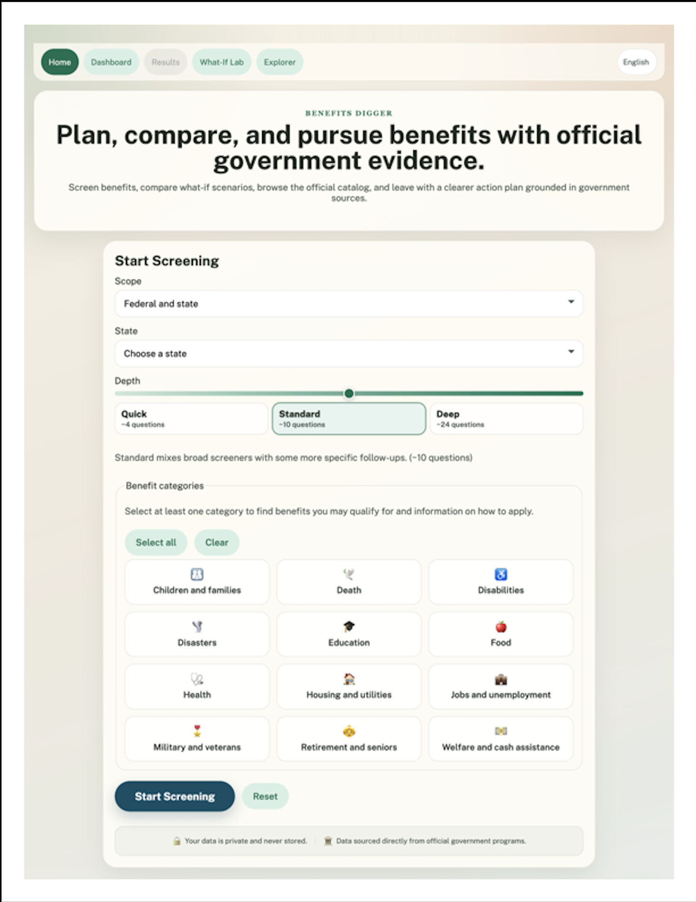
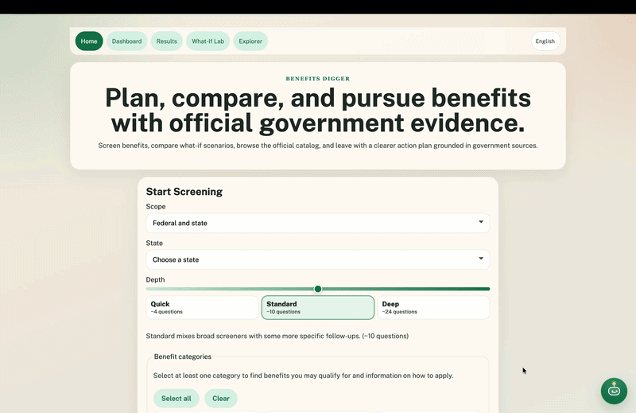
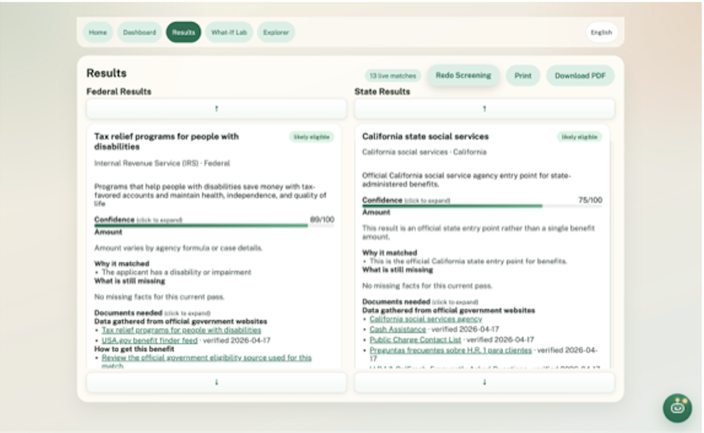
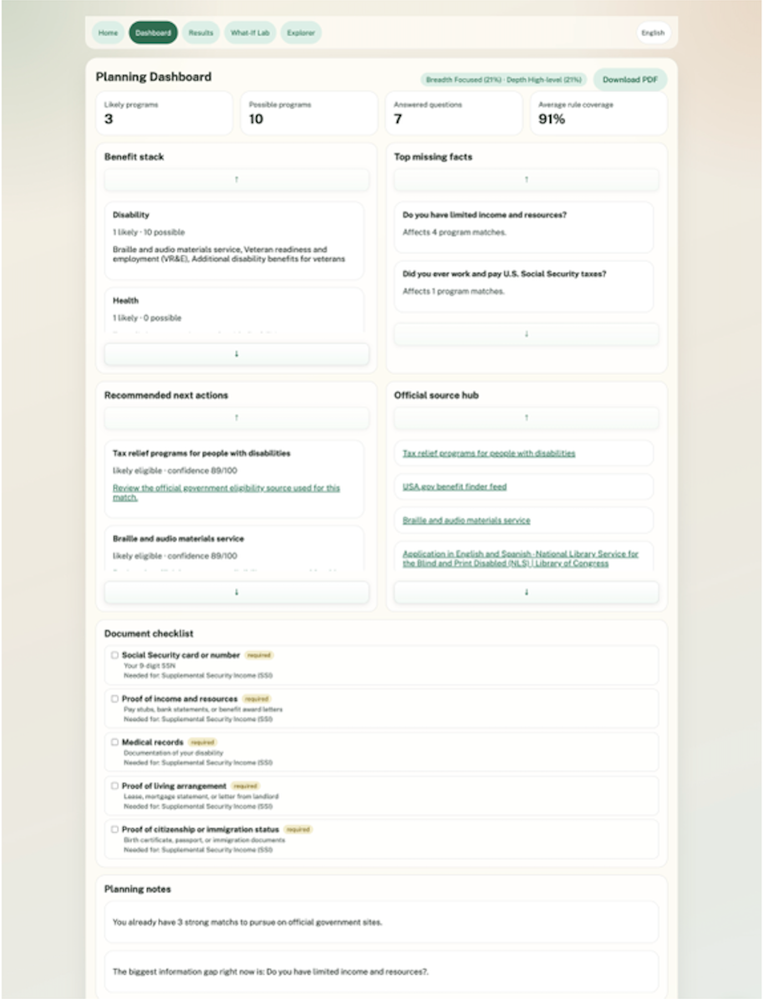

# Benefits Digger

Benefits Digger is a government-benefits screening platform that helps users identify eligible federal and state benefits programs. It combines rule-based eligibility screening with AI-powered state program generation, adaptive questioning, scenario comparison, and official government sources only.

## What It Does Today

- **Adaptive screening** — asks the right questions based on your chosen depth (Quick / Standard / Deep)
- **Federal + state coverage** — ingests the official USA.gov benefit-finder feed and state social-services directory
- **AI-powered state programs** — uses Google Gemini to generate state-specific program catalogs on demand
- **Explainable confidence scoring** — multi-factor certainty breakdown instead of a single arbitrary score
- **Planning dashboard** — benefit stack, top next steps, missing-fact priorities, and official source hub
- **What-If Lab** — compare hypothetical scenario changes without overwriting your session
- **Program Explorer** — searchable catalog of all federal and state programs
- **Source versioning** — tracks when official sources change and creates review tasks
- **Offline-capable** — seeds a local starter catalog so the app boots without network access
- **Official links only** — all displayed sources and application paths point to `.gov` / `.mil` / `.us` domains

### My Contributions
* **Engineered** the high-performance JavaScript/CSS frontend and interactive geographic filters.
* **Integrated** the Gemini API to power the adaptive questionnaire and recommendation engine.
* **Deployed** the Zobo chatbot and multi-language support for enhanced accessibility.

### 🏠 The Interface


### ⚙️ Dynamic Screening in Action


### 📊 Program Results


### 🎛️ User Dashboard


## Tech Stack

| Layer | Technology |
|-------|-----------|
| Backend | FastAPI 0.115, Uvicorn, Python 3 |
| Database | SQLite + SQLAlchemy 2.0 |
| AI | Google Gemini 2.5 Flash (state program generation) |
| Frontend | Vanilla HTML / CSS / JS (no framework) |
| Testing | pytest |

## Project Structure

```
benefits-digger/
├── app/
│   ├── main.py            # FastAPI app, routing, startup hooks
│   ├── config.py           # Settings via pydantic-settings
│   ├── db.py               # SQLAlchemy engine & session
│   ├── models.py           # 15 ORM models (programs, sessions, rules, sources, …)
│   ├── schemas.py          # Pydantic request/response schemas
│   ├── services.py         # Core business logic (~1100 lines)
│   ├── rules.py            # Eligibility rule evaluation
│   ├── catalog.py          # USA.gov feed fetching & parsing
│   ├── gemini.py           # Gemini AI integration for state programs
│   ├── normalizers.py      # Answer normalization
│   ├── seed_data.py        # Fallback bootstrap data
│   └── static/             # Frontend assets
│       ├── index.html      # Home / screening page
│       ├── dashboard.html  # Planning dashboard
│       ├── results.html    # Results display
│       ├── whatif.html     # What-If Lab
│       ├── explorer.html   # Program Explorer
│       ├── shared.js       # Shared utilities & state
│       ├── home.js         # Home page logic
│       ├── dashboard.js    # Dashboard logic
│       ├── results-page.js # Results logic
│       ├── whatif-page.js  # What-If Lab logic
│       ├── explorer-page.js# Explorer logic
│       └── styles.css      # Styles
├── tests/
│   ├── test_api.py         # API endpoint tests
│   └── test_rules.py       # Rule evaluation tests
├── requirements.txt
└── README.md
```

## Run It

```bash
# Clone and set up
git clone <repo-url>
cd benefits-digger
python3 -m venv .venv

# Activate the virtual environment
source .venv/bin/activate          # macOS / Linux
.venv\Scripts\activate             # Windows

# Install dependencies
pip install -r requirements.txt

# Start the server
uvicorn app.main:app --reload
```

Open [http://127.0.0.1:8000](http://127.0.0.1:8000).

Interactive API docs are available at [http://127.0.0.1:8000/docs](http://127.0.0.1:8000/docs) (auto-generated by FastAPI).

## Configuration

Configuration is managed via environment variables (or a `.env` file):

| Variable | Default | Description |
|----------|---------|-------------|
| `BENEFITS_DIGGER_GEMINI_API_KEY` | `""` | Google Gemini API key for AI-powered state program generation |
| `BENEFITS_DIGGER_GEMINI_MODEL` | `gemini-3-pro-preview` | Gemini model used across the app's LLM-backed features |
| `BENEFITS_DIGGER_GEMINI_STRUCTURED_TEMPERATURE` | `0.3` | Default temperature for JSON/structured Gemini tasks |
| `BENEFITS_DIGGER_GEMINI_CHAT_TEMPERATURE` | `0.7` | Default temperature for conversational Gemini tasks |
| `BENEFITS_DIGGER_GEMINI_SEARCH_GROUNDING_ENABLED` | `true` | Enables Google Search grounding on Gemini calls through the shared LLM helper |
| `BENEFITS_DIGGER_ADMIN_KEY` | `""` | Optional key to protect admin endpoints (`X-Admin-Key` header) |
| `BENEFITS_DIGGER_DATABASE_URL` | `sqlite:///benefits_digger.db` | SQLite database path |
| `BENEFITS_DIGGER_AUTO_SYNC_REMOTE` | `true` | Sync official USA.gov sources on startup |
| `BENEFITS_DIGGER_MAX_RESULTS_PER_SECTION` | `12` | Max results per federal/state section |
| `BENEFITS_DIGGER_REQUEST_TIMEOUT_SECONDS` | `20.0` | HTTP request timeout for remote fetches |

## Render Deployment

This repo now includes [render.yaml](./render.yaml) so you can deploy it as a Render Blueprint.

What to set in Render:

- `BENEFITS_DIGGER_GEMINI_API_KEY` as a secret in the Render dashboard
- `BENEFITS_DIGGER_GEMINI_MODEL` defaults to `gemini-3-pro-preview`
- the app will start with:
  - `uvicorn app.main:app --host 0.0.0.0 --port $PORT`

Important note:

- the app currently uses SQLite by default, so it will run on Render, but data will be ephemeral unless you later attach persistent storage or move to Postgres
- your local `.env` is intentionally not committed; use `.env.example` locally and Render environment variables in the cloud

## Pages

| Route | Page | Description |
|-------|------|-------------|
| `/` | Home | Start a screening session — choose scope, state, depth, and categories |
| `/results` | Results | Federal and state result cards with confidence scores and sources |
| `/dashboard` | Dashboard | Benefit stack, missing facts, action plan, and source hub |
| `/whatif` | What-If Lab | Compare preset or custom scenarios against your baseline |
| `/explorer` | Explorer | Browse and search the full program catalog (no session required) |

## Depth Modes

The screener supports three depth levels that control how many questions are asked:

| Mode | Max Questions | Best For |
|------|--------------|----------|
| Quick | 4 | Fast, high-level snapshot |
| Standard | 10 | Balanced coverage |
| Deep | 24 | Thorough, detailed screening |

Higher depth unlocks more sensitive questions and uses detailed question variants.

## Confidence Scoring

Each result includes a certainty score (0–100) built from five weighted factors:

| Factor | Weight | Measures |
|--------|--------|----------|
| Rule coverage | 35% | % of eligibility rules with a user answer |
| Source authority | 20% | Authority rank of the program's official sources |
| Source freshness | 20% | How recently the source data was verified |
| Program determinism | 15% | How specific the eligibility criteria are |
| Amount determinism | 10% | How certain the benefit amount is |

## API Endpoints

### Public

| Method | Path | Description |
|--------|------|-------------|
| `GET` | `/health` | Database connectivity check |
| `GET` | `/api/v1/jurisdictions/states` | List all states |
| `GET` | `/api/v1/programs` | Search/filter programs (`?query=`, `?scope=`, `?state_code=`, `?categories=`, `?limit=`) |
| `GET` | `/api/v1/programs/{slug}` | Program detail |
| `POST` | `/api/v1/sessions` | Create a screening session |
| `POST` | `/api/v1/sessions/{id}/answers` | Submit answers |
| `GET` | `/api/v1/sessions/{id}/results` | Get eligibility results |
| `GET` | `/api/v1/sessions/{id}/plan` | Get planning dashboard data |
| `POST` | `/api/v1/sessions/{id}/compare` | Run scenario comparison |

### Admin (requires `X-Admin-Key` header)

| Method | Path | Description |
|--------|------|-------------|
| `GET` | `/api/v1/admin/review-tasks` | List pending source-change review tasks |
| `POST` | `/api/v1/admin/sync` | Manually trigger remote source sync |

## Tests

```bash
pytest
```

## Current Scope

The federal layer ingests the official USA.gov benefit-finder feed. The state layer ingests the USA.gov state social-services directory and can generate additional state programs via Gemini AI. The state architecture is fully wired, but per-state program catalogs are connector-ready rather than exhaustive.

## Roadmap / Suggested Features

### High Impact

- **User accounts & saved sessions** — sessions are currently localStorage-only with no cross-device persistence
- **PDF / print export** — let users save or share their benefits report as a document
- **Multi-language support (i18n)** — many benefits-eligible users need non-English access
- **Document checklist per program** — list what paperwork and documents to gather before applying
- **Benefit amount estimator** — replace static amount text with calculations based on user inputs

### Medium Impact

- **Application status tracker** — help users track where they are in each program's application process
- **Mobile-responsive redesign** — improve the CSS for phone and tablet users
- **Accessibility (WCAG 2.1 AA)** — screen reader support, full keyboard navigation, contrast ratios
- **Docker containerization** — add a Dockerfile and docker-compose for easy deployment

### Developer Experience

- **CI/CD pipeline** — automated testing and deployment on push
- **Expanded test coverage** — add frontend tests and increase backend coverage
- **Rate limiting & security headers** — production hardening (CORS tightening, helmet-style headers)
- **Database migrations with Alembic** — replace ad-hoc column checks with proper migration management
